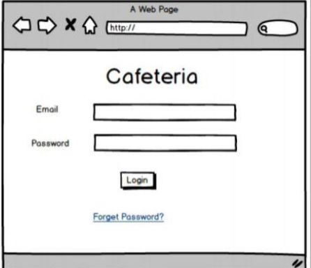

# Ecommerce_iti

https://maged-ghabour.github.io/Ecommerce_iti/

### screen One

- [ ] `Done`     Login
- [ ] `Done`    Show All Product
- [ ] `Done`    filter categories
- [ ] `Done`    Logout

### Cart
- [x] `Done`  Add Product To Cart
- [x] `Done`  delete product from cart
- [x] `Done`  delete All products from cart

### Extra
- [x] `Done`  validation to image 
- [x] `Done`  Check if Product Exists Not Add New Product
- [x] `Done`  Sweet Alert

## What's Next 
- [x] `Done`  product Cards design 
- [ ] `Done`  Cart page Design 
- [ ] `Done`  Registration 

### Admin

- [x] `Done`      Add Product  
- [x] `Done`      Delete Product
- [x] `Done`      Add Categories in localStorage and Put it in Select
- [x] `Done`      Edit Product
- [x] `Done`      Search to Product
- [ ] `Done`      show All users
- [x] `Done`      Login
- [x] `Done`.     Logout

## Questions 
 - [ ] `Done`   Cookie  لل   hasing  هل ممكن اني اعمل  

## Notes 
- [ ] Can't update the image  

